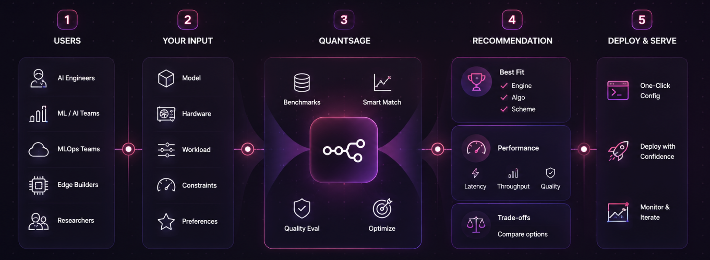

SageQuant answers one question: **given my model, my hardware, and my latency/quality budget which inference engine, quantization algorithm, and bit-width scheme should I use, and how do I run it?**

It answers from real benchmark data, not guesswork.
---

## Why this exists

Picking a serving stack today usually looks like this: default to vLLM because it's what everyone uses, try W4A16 because a blog post said so, eyeball the output, ship it if nothing looks broken. Nobody actually compares vLLM against SGLang or TensorRT-LLM for their workload, or GPTQ against AWQ at the same bit-width — until a customer complains about quality, or the latency numbers don't add up.

SageQuant replaces the guess with a lookup across three separate decisions — engine, quantization algorithm, and bit-width — each backed by measured runs, not a blog post written on a different GPU generation.

## Who this is for

- You're deploying an LLM and don't want to burn days benchmarking multiple engines and quant schemes yourself
- You're optimizing inference cost and need a defensible number, not a guess
- You're comparing vLLM, SGLang, or TensorRT-LLM for your actual workload and want data instead of GitHub star counts
- You're on constrained hardware (edge, single GPU, Apple Silicon) and need to know what actually fits before you try

**Before SageQuant:** default to vLLM + W4A16, hope it's right, repeat the exercise by hand if it isn't.
**After SageQuant:** one command tells you which engine, which quant algorithm, and which bit-width hits your latency and quality bar — with the eval method and confidence level behind that answer.

## See the tradeoff, not just an answer

Same model, same hardware, same workload shape (512 prompt / 256 output tokens), across engines and algorithms — this is the kind of comparison SageQuant is built to shortcut:

| Engine | Quant algo | Scheme | TTFT (p50 / p95) | Throughput | Quality vs fp16 |
|--------|-----------|--------|-------------------|------------|------------------|
| vLLM | none | fp16 | 85 / 140ms | 45.0 tok/s | baseline |
| vLLM | GPTQ | w4a16 | 145 / 210ms | 38.2 tok/s | -1.1% (mmlu-5shot, n=200) |
| vLLM | AWQ | w4a16 | 140 / 205ms | 39.5 tok/s | -0.8% (mmlu-5shot, n=200) |
| SGLang | AWQ | w4a16 | 98 / 165ms | 52.0 tok/s | -1.4% (mmlu-5shot, n=200) |

`recommend` picks one of these based on *your* constraints instead of you eyeballing a table like this yourself. It always reports p95, not just a mean — a latency budget is protecting against the bad case, and a mean-only number hides that. It also always tells you which eval (`mmlu-5shot`, `perplexity/wikitext2`, etc.) the quality number is grounded in and how many examples it's based on, since "quality dropped 1%" means very different things at 20 examples versus 500.



## What's covered today

**Hardware:** A100 (40GB), RTX 4090, T4, Apple M1 Pro
**Inference engines:** vLLM, SGLang, TensorRT-LLM, MLX (Apple Silicon)
**Quantization algorithms:** GPTQ, AWQ, SmoothQuant, native FP8, MLX quantization

Coverage grows with every contribution — see [`contribute`](#contribute--add-your-own-benchmark-runs) below. If your hardware or engine isn't listed, `recommend` will say so honestly (`confidence: interpolated` or `no_data`) rather than pretend it knows.

---

## Install

```bash
pip install -e .
```

**Optional (for better interpolation):**
```bash
pip install -e ".[advanced]"  # adds pandas, scikit-learn, streamlit
```

**Optional (to run your own benchmarks instead of hand-filling JSON):**
```bash
pip install -e ".[benchmark]"  # adds guidellm, lm-eval
```

---

## Commands

### `recommend` — get a full recommendation: engine, algorithm, scheme

```bash
sage-quant recommend --model-size 7b --hardware a100-40gb
```

```
Recommended: vLLM + none (fp16)
Workload: 128 in / 128 out tokens (default)
Expected: 85ms TTFT (p50) · 140ms TTFT (p95) · 45.0 tok/s · +0.0% quality (mmlu-5shot, n=200)
Confidence: exact (3 matching benchmark runs)
```

With constraints, including your actual workload shape — SageQuant will cross engines and algorithms to find the best fit:
```bash
sage-quant recommend \
  --model-size 70b \
  --hardware a100-40gb \
  --max-latency 300ms \
  --min-quality 99 \
  --prompt-tokens 512 --output-tokens 256
```

`--max-latency` is checked against p95, not the mean — it's a budget for the bad case, not the average case. `--prompt-tokens`/`--output-tokens` default to 128/128 if omitted, but the answer can change meaningfully with workload shape, so it's worth setting explicitly if you know your real traffic pattern.

Prefer a specific engine and let SageQuant only optimize the algorithm/scheme:
```bash
sage-quant recommend --model-size 7b --hardware a100-40gb --prefer-engine sglang
```

Confidence is always one of:
- **`exact`** — direct dataset match for this model size, hardware, engine, and algorithm (downgraded to `exact (low sample)` if the backing eval had fewer than ~50 examples)
- **`interpolated`** — estimated from similar hardware/sizes/engines/workload shapes; treat as a starting point, not a guarantee
- **`no_data`** — nothing close enough to estimate from; try a different hardware, engine, or looser bound

The quality number is always paired with the `eval_method` and the sample size it came from (e.g. `mmlu-5shot, n=200` vs `perplexity/wikitext2, n=50`) — a percentage without knowing the eval and sample count behind it isn't a number you can act on.

---

### `serve-config` — get a copy-pasteable launch command for the recommended engine

```bash
sage-quant serve-config \
  --model-size 7b \
  --hardware a100-40gb \
  --model meta-llama/Meta-Llama-3-8B-Instruct
```

```
Recommended: vLLM + none (fp16)
Expected: 85ms TTFT · 45.0 tok/s · +0.0% quality (mmlu-5shot)
Confidence: exact

Platform: vllm

Launch command:
  vllm serve meta-llama/Meta-Llama-3-8B-Instruct --host 0.0.0.0 --port 8000
```

If SGLang or TensorRT-LLM is recommended, the launch command changes to match — including a note when a build step is required (TensorRT-LLM needs a hardware-specific engine build before it can serve).

For Apple Silicon:
```bash
sage-quant serve-config \
  --model-size 7b \
  --hardware m1-pro \
  --model mlx-community/Meta-Llama-3-8B-Instruct-4bit \
  --min-quality 98
```

Save the config to a file:
```bash
sage-quant serve-config --model-size 7b --hardware a100-40gb \
  --model meta-llama/Meta-Llama-3-8B-Instruct --out config.yaml
```

---

### `list-hardware` / `list-engines` / `list-quant-algos` — see what's in the dataset

```bash
sage-quant list-hardware
```
```
a100-40gb
m1-pro
rtx-4090
t4
```

```bash
sage-quant list-engines
```
```
vllm
sglang
tensorrt-llm
mlx
```

```bash
sage-quant list-quant-algos
```
```
gptq
awq
smoothquant
fp8
mlx-quant
none
```

---

### `contribute` — add your own benchmark runs

```bash
sage-quant contribute --run-log my_run.json
```

**`my_run.json`:**
```json
{
  "model_size_b": 13.0,
  "hardware": "a100-40gb",
  "inference_engine": "sglang",
  "quant_algo": "awq",
  "quant_scheme": "w8a8",
  "ttft_ms": 125.0,
  "throughput_tok_s": 32.0,
  "perplexity_delta": 0.15,
  "task_score_delta": -0.45,
  "eval_method": "mmlu-5shot",
  "vram_gb": 22.0,
  "source": "your-name"
}
```

Also accepts CSV. After appending, it prints instructions for opening a PR to share your data.

If you installed the `[benchmark]` extra, you can skip the hand-filled JSON and let SageQuant run the measurement itself:
```bash
sage-quant contribute --benchmark --model-size 13b --hardware a100-40gb \
  --engine sglang --quant-algo awq --model your-org/your-model
```
This runs `guidellm` for latency/throughput and `lm-eval` for quality, then appends the result automatically.

The dataset only gets better with more contributors — if you've benchmarked an engine, algorithm, or hardware combo that isn't listed above, this is the fastest way to help the next person who needs that same answer.

---

## Optional: config file

Create `~/.sage-quant/config.yaml` to set defaults:

```yaml
default_hardware: a100-40gb
min_quality_default: 97
default_eval_method: mmlu-5shot
dataset_path: ~/.sage-quant/benchmarks.csv   # point at your own data
```

CLI flags always override the config file.

---

## Dataset

All recommendations come from `data/benchmarks.csv`. Every row is one benchmark run for a specific (model size, hardware, engine, quant algorithm, bit scheme) combination:

| Column | Description |
|--------|-------------|
| `model_size_b` | Model size in billions |
| `hardware` | Hardware slug (e.g. `a100-40gb`, `m1-pro`) |
| `inference_engine` | Serving stack (`vllm`, `sglang`, `tensorrt-llm`, `mlx`) |
| `quant_algo` | Quantization method (`gptq`, `awq`, `smoothquant`, `fp8`, `mlx-quant`, `none`) |
| `quant_scheme` | Bit-width config (e.g. `fp16`, `w4a16`, `w8a8`, `q4`) |
| `prompt_tokens` / `output_tokens` | Workload shape this row was measured under — TTFT/throughput at 32/16 tokens isn't comparable to 2000/500 |
| `prefix_caching` | Whether prefix caching was enabled for this run (`true`/`false`) |
| `ttft_p50_ms` / `ttft_p95_ms` | Time to first token, median and tail |
| `throughput_tok_s` | Tokens per second |
| `task_score_delta` | % quality change vs fp16 baseline (negative = worse) |
| `eval_method` | The benchmark the quality numbers came from (e.g. `mmlu-5shot`, `perplexity/wikitext2`) |
| `eval_sample_size` | How many examples that quality number is based on |
| `vram_gb` | VRAM used |
| `source` | Who measured it |

**The dataset is the product.** The more rows — across hardware, engines, algorithms, and workload shapes — the better the recommendations.

**Deliberately not columns here:** quantization calibration settings, generation sampling params (temperature/top_p/top_k), and model architecture facts (layer count, KV head count). These matter for reproducing or explaining a row, but they're not something a user picks when asking for a recommendation — they live in `catalog.py` or run metadata instead. See the SKILL.md for the full reasoning if you're extending the schema.

---

## How this differs from a quantization guide

Most inference advice online picks one axis in isolation — "just use W4A16," or "vLLM is the standard" — written for one model on one GPU generation. SageQuant isn't advice — it's a lookup against measured runs across all three decisions at once (engine, algorithm, bit-width), so the answer changes correctly when your model, hardware, workload, or quality bar changes.

## Contributing

See [`contribute`](#contribute--add-your-own-benchmark-runs) above for adding benchmark data. Code contributions (new engines in `serve-config`, new quant algorithms in the catalog, better interpolation, dashboard work) are welcome via PR — open an issue first for anything larger than a small fix.

## License

MIT — use it, fork it, ship it.